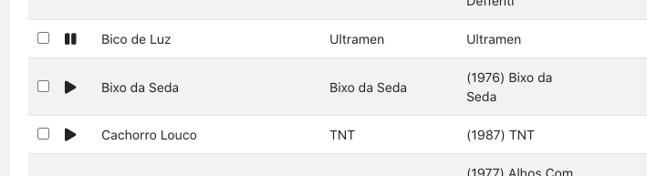
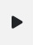

Mini Audio Player
=================
This is a mini audio player for Angular (not js).

Simple file [source code](ngx-mini-audio-player.ts).

## Dependencies
- [Angular 8+](https://angular.io/);
- [Fontawesome](https://fontawesome.com/) or [Fortawesome](https://fortawesome.com/).

## Example of usage
```html
<ngx-mini-audio-player [url]="https://www.soundhelix.com/examples/mp3/SoundHelix-Song-1.mp3"></ngx-mini-audio-player>
```





## Upcoming changes planned:
- Create better documentation;
- Create a sample and demo project;
- Create a package for npm.
